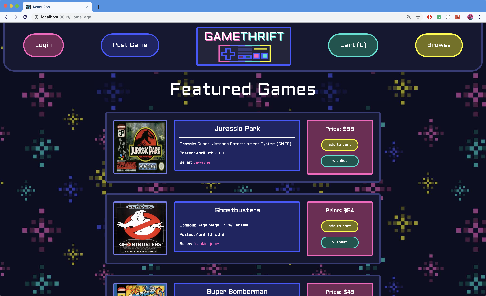

A vintage video game e-commerce site for finding all the games you’ve been wanting to play since the 90’s.
Created by Nison Malayev and Evan Pavley.

## Design Ideas

We wanted gamethrift's UI to have the look and feel of a classic video game's select screen. The color palette was inspired by arcades and neon signs.
